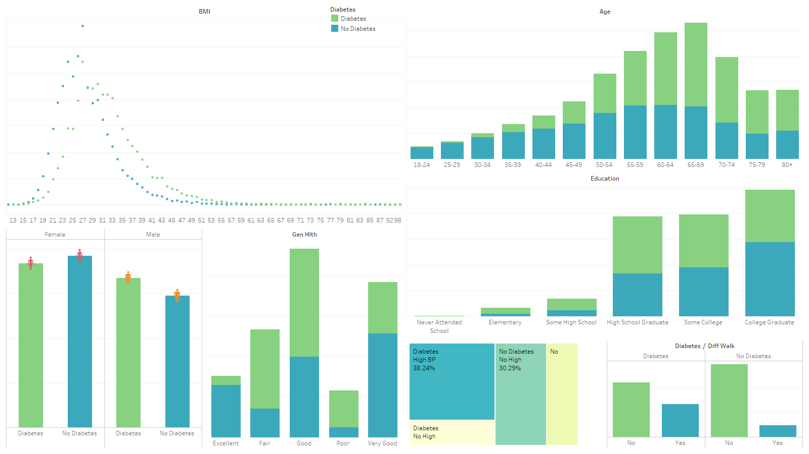
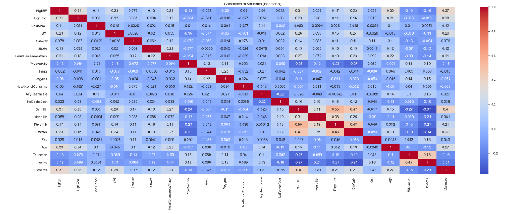
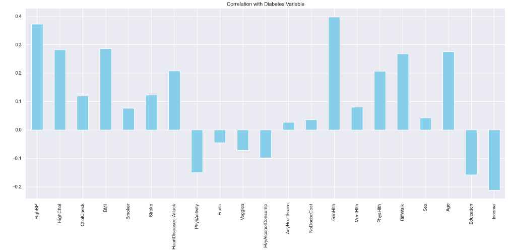
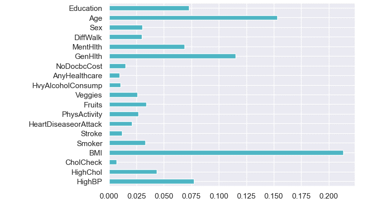

# LHL_Capstone_Project: Exploring Predictive Modeling of Type 2 Diabetes Indicators

This is my final Project for LightHouse Labs Data Analytics Diploma Course. I chose to work with the Diabetes Health Indicators dataset obtained from [Kaggle](https://www.kaggle.com/datasets/alexteboul/diabetes-health-indicators-dataset). It's based on responses from the 2015 CDC Behavioral Risk Factor Surveillance System (BRFSS).

## Problem Statement: Type 2 Diabetes
**Type 2 diabetes** is a prevalent and chronic metabolic disorder characterized by high levels of blood sugar (glucose) resulting from insulin resistance and a relative insulin deficiency.
- **Risk Factors:** Risk factors include genetics, obesity, physical inactivity, unhealthy diet, age, and certain ethnic backgrounds.
- **Prevalence in the US and Canada:**
The prevalence of type 2 diabetes has been steadily increasing in the United States. According to the CDC, over 34 million Americans (about 10% of the population) have diabetes, and the majority of these cases are type 2.
In Canada, approximately 3.4 million people have diabetes, and the majority have type 2 diabetes.
- **Reduced Quality of Life:** Untreated or poorly managed type 2 diabetes can lead to serious health complications, including heart disease, stroke, kidney disease, blindness, nerve damage, and lower limb amputations. Living with diabetes can affect a person's quality of life due to the need for daily self-management, dietary restrictions, and the risk of complications.
- **Preventable and Reversible Nature:**
Type 2 diabetes is largely preventable through lifestyle modifications and in many cases, type 2 diabetes can be effectively managed and even reversed by adopting a healthy lifestyle.

Using predictive modeling to understand the risk factors most indicative of Type 2 diabetes can aid in targeting management strategies which can significantly reduce the prevalence and impact of this disease.

## Project Process
- ### **Exploratory Data Analysis**
The data was analysed with python and tableau to gain insights and understanding of the data and variable relationships. Visualizations include the below:

- ### **Modeling**
3 models were fitted using Logistic Regression, Random Forest Classifier and Decision Tree Classifier. The main focus was to have a model with reasonable recall - *Out of all instances that are diabetes, how many can the model accurately identify as diabetic?* 

The Logistic Regression model had the highest recall and accuracy and the Decision Tree model had the lowest.

- ### **Results**
The factors identified as most predictive of diabetes are shown in the figure below:

BMI has the highest predictive importance, followed by Age.

## Challenges
- The first dataset was very imbalanced and provided poor results with the models, I had to repeat my processes with a modified dataset that had better data balance.

## Future Goals
- Exploring more highly correlated risk factors such as genetics, eyesight, blood sugar and possibly more data and techniques to create a better model.
- Delving into more public health-related research on chronic diseases and their indicators such as for cancer.

